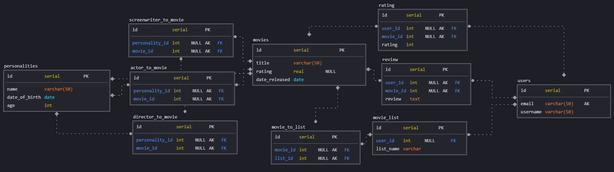

# MoviesDB

## Описание
Сервис, предоставляющий информацию о фильмах по типу Кинопоиска или IMDb. На нем могут регистрироваться пользователи, ставить оценки фильмам, писать рецензии на фильмы и составлять подборки фильмов.
## Структура базы данных
1. movies (id, title, rating, date_released) - информация о фильме
2. personalities (id, name, date_of_birth, age) - информация о человеке (это может быть актер, режиссер, сценарист или всё сразу)
3. director_to_movie (personality_id, movie_id) - отношение many-to-many между Режиссером фильмом
4. actor_to_movie (personality_id, movie_id) - отношение many-to-many между Актером фильмом
5. screenwriter_to_movie (personality_id, movie_id) - отношение many-to-many между Сценаристом фильмом
6. users (id, email, nickname) - пользователь сайта, может ставить оценку фильмам и составлять подборки фильмов.
7. rating (id, user_id, movie_id, rating) - оценка пользователя фильму
8. review (id, user_id, movie_id, content) - рецензия пользователя на фильмам
9. movie_list (id, user_id, list_name) - подборка фильмов, которую может создать пользователь
10. movie_to_list (list_id, movie_id) - отношение many-to-many между подборкой фильмов и фильмом

# Схема базы данных

